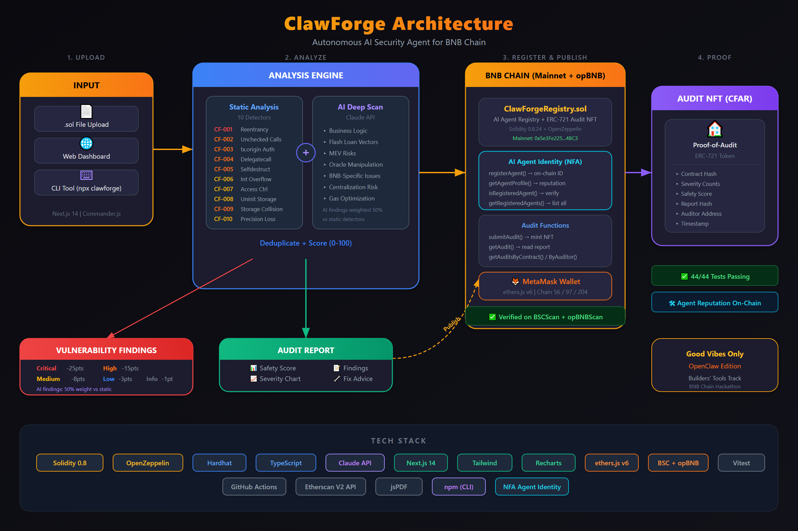

# ClawForge

**AI-Powered Smart Contract Security Auditor for BNB Chain**

ClawForge combines static analysis with Claude AI to detect vulnerabilities in Solidity smart contracts and mint on-chain proof-of-audit NFTs (ERC-721) on BNB Chain.



---

## How It Works

```
Upload .sol  →  Static Analysis (8 detectors)  →  AI Deep Scan (Claude)  →  Review Findings  →  Mint Audit NFT
```

1. **Upload** a Solidity file (.sol) via CLI or web dashboard
2. **Static analysis** runs 8 vulnerability detectors (reentrancy, tx.origin, selfdestruct, delegatecall, unchecked calls, integer overflow, access control, uninitialized storage)
3. **AI analysis** via Claude API performs deep logic review (flash loans, MEV, oracle manipulation, business logic)
4. **Review** the consolidated report with safety score (0-100), severity breakdown, and remediation advice
5. **Publish** the audit on-chain as an ERC-721 NFT on BNB Chain — immutable proof of security assessment

---

## Architecture

```
clawforge/
├── packages/
│   ├── contracts/       # Solidity smart contracts (Hardhat)
│   │   ├── contracts/
│   │   │   ├── ClawForgeRegistry.sol          # ERC-721 audit registry
│   │   │   └── interfaces/IClawForgeRegistry.sol
│   │   ├── test/        # 17 test cases
│   │   └── scripts/     # Deployment scripts
│   │
│   ├── cli/             # Node.js CLI (Commander.js)
│   │   ├── src/
│   │   │   ├── analyzers/static/detectors/    # 8 vulnerability detectors
│   │   │   ├── analyzers/ai/                  # Claude API integration
│   │   │   ├── report/                        # JSON + HTML report generator
│   │   │   ├── chain/                         # BSC on-chain publisher
│   │   │   └── commands/                      # audit, publish, explore
│   │   └── test/        # 17 test cases
│   │
│   └── web/             # Next.js 14 Dashboard
│       └── src/app/
│           ├── page.tsx         # Landing + drag-and-drop upload
│           ├── audit/           # Results (score, chart, findings)
│           ├── explore/         # On-chain audit explorer
│           └── api/audit/       # Backend analysis endpoint
│
├── .env.example
└── README.md
```

---

## Static Analysis Detectors

| ID | Detector | Severity | Description |
|----|----------|----------|-------------|
| CF-001 | Reentrancy | Critical | External call before state update (checks-effects-interactions violation) |
| CF-002 | Unchecked Calls | High | Low-level `.call()` without return value check |
| CF-003 | tx.origin Auth | High | `tx.origin` used for authentication (phishing risk) |
| CF-004 | Delegatecall | High | `delegatecall` to potentially untrusted target |
| CF-005 | Selfdestruct | High | Contract can be permanently destroyed |
| CF-006 | Integer Overflow | Medium | Pre-0.8.0 contract without SafeMath |
| CF-007 | Access Control | Medium | Public state-changing function without modifier |
| CF-008 | Uninitialized Storage | Medium | Storage pointer declared without initialization |

---

## Smart Contract

**ClawForgeRegistry.sol** — ERC-721 NFT registry for on-chain audit proofs.

- Each audit is minted as a transferable NFT (CFAR — ClawForge Audit Report)
- Stores: contract hash, severity counts, safety score, report hash, auditor address, timestamp, chain ID
- Query functions: `getAudit()`, `getAuditsByContract()`, `getAuditsByAuditor()`, `getAuditCount()`
- Network: BSC Testnet (Chain ID 97)

---

## Quick Start

### Prerequisites

- Node.js 18+
- npm 9+
- MetaMask (for web dashboard)
- BNB Testnet faucet tokens ([faucet.bnbchain.org](https://www.bnbchain.org/en/testnet-faucet))

### Installation

```bash
git clone https://github.com/YOUR_USERNAME/clawforge.git
cd clawforge
npm install
```

### Environment Setup

```bash
cp .env.example .env
# Edit .env with your keys:
#   PRIVATE_KEY       — BSC wallet private key (for deployment + publishing)
#   BSCSCAN_API_KEY   — BSCScan API key (for contract verification)
#   ANTHROPIC_API_KEY  — Claude API key (for AI analysis)
```

### Run Tests

```bash
# All tests (34 total)
npm test

# Contract tests only (17 tests)
npm run test:contracts

# CLI tests only (17 tests)
npm run test:cli
```

### Deploy Smart Contract

```bash
# Deploy to BSC Testnet
npm run deploy:testnet
```

### Use the CLI

```bash
cd packages/cli

# Audit a Solidity file
npx ts-node src/index.ts audit path/to/Contract.sol

# Publish audit on-chain
npx ts-node src/index.ts publish path/to/report.json

# Explore on-chain audits
npx ts-node src/index.ts explore
```

### Run Web Dashboard

```bash
npm run dev:web
# Open http://localhost:3000
```

1. Drag & drop a `.sol` file on the landing page
2. Review the safety score, severity chart, and findings
3. Connect MetaMask and publish the audit on BNB Chain

---

## Tech Stack

| Layer | Technology |
|-------|-----------|
| Smart Contracts | Solidity 0.8.24, OpenZeppelin, Hardhat |
| CLI | TypeScript, Commander.js, Vitest |
| AI Engine | Anthropic Claude API (claude-sonnet-4-5-20250929) |
| Blockchain | ethers.js v6, BSC Testnet (Chain ID 97) |
| Web Dashboard | Next.js 14, Tailwind CSS, Recharts |
| Wallet | ethers.js BrowserProvider + MetaMask |

---

## Test Results

```
Smart Contracts: 17/17 passing
CLI Detectors:   17/17 passing
Web Build:       ✓ Compiled successfully
─────────────────────────────────
Total:           34/34 tests passing
```

---

## Hackathon

Built for **Good Vibes Only: OpenClaw Edition** on BNB Chain — Builders' Tools track.

ClawForge addresses a critical gap in the BNB ecosystem: accessible, automated smart contract security auditing with on-chain proof. By combining static analysis with AI deep scanning and minting immutable NFT audit reports, we make security auditing transparent, verifiable, and permanent.

---

## License

MIT
